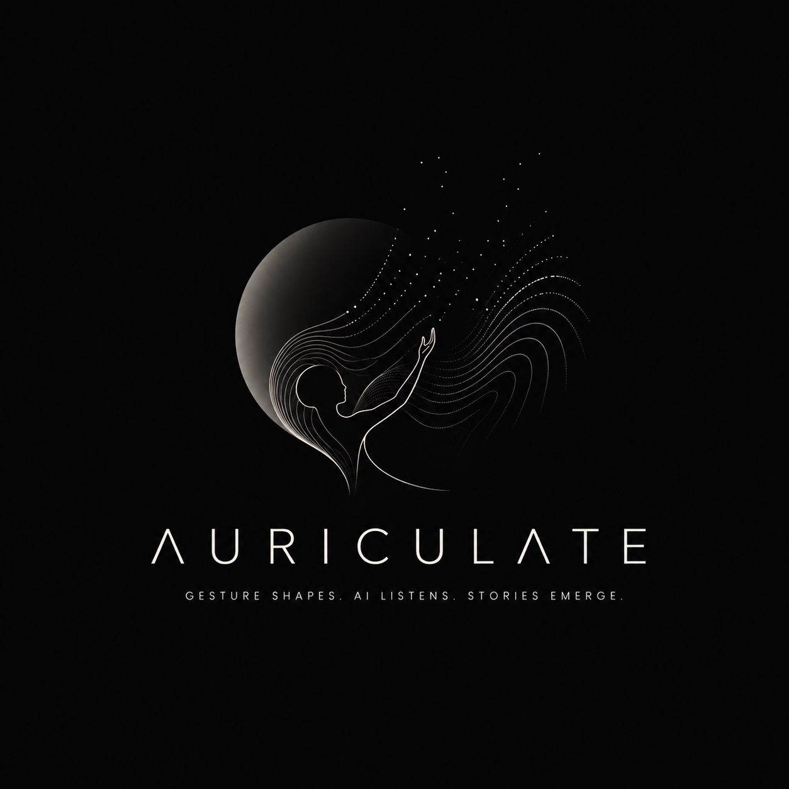

<a id="readme-top"></a>

<div align="center">
  

  <h2>🎵 Auriculate</h2>

  <p>
    Conduct a soundscape with your hands.
    <br/>
    Gesture-driven · Real-time · Performative
  </p>

<a href="https://voskamp099.github.io/Auriculate-BETA-Hackathon-2026/"><strong>Live Demo »</strong></a>

</div>

---
## Table of Contents

- [About the Project](#about-the-project)
- [Quick Start](#quick-start)
- [Installation](#installation)
  - [Requirements](#requirements)
  - [Steps](#steps)
- [Usage](#usage)
- [Configuration](#configuration)
---
## About the Project

**Auriculate** is a browser-based system where you:

* ✋ Use **hand gestures** to control sound
* 🎧 Generate a **live soundscape in real time**
* 🎭 Perform — not edit — your audio

No timeline. No post-production. Just presence.

---
### Built with

* MediaPipe (hand tracking)
* Web Audio API
* Vanilla JS

Latency target: **<100ms**

---
##  Quick Start

```bash
npx serve
```

Open http://localhost:3000

---
##  User Guide

* 🟡 Left hand → **volume**
* 🟢 Right hand → **sound trigger**

### Ambience (loop)

| Gesture | Sound   |
| ------- | ------- |
| ☝️      | Wind    |
| ✌️      | Rain    |
| 🤟      | Thunder |
| 🤙      | Birds   |
| ✊       | Stop    |

### SFX (one-shot)

| Gesture | Sound      |
| ------- | ---------- |
| 👌      | Dog bark   |
| ☝️      | Guzheng    |
| ✌️      | Footsteps  |
| 🤟      | Door knock |
| ✊       | Stop       |

### Switch modes

* 👍👍 → SFX
* 👎👎 → Ambience

---
## Motivation

AI makes content cheap — but removes the human moment.

Auriculate does the opposite:

> It keeps performance live, embodied, and unrepeatable.

Inspired by *口技 (kouji)* — an ancient Chinese art of creating entire worlds using only the human voice.

---
##  Contact

Auriculate Team - Voskamp099@github - raelynn.z6113@gmail.com
